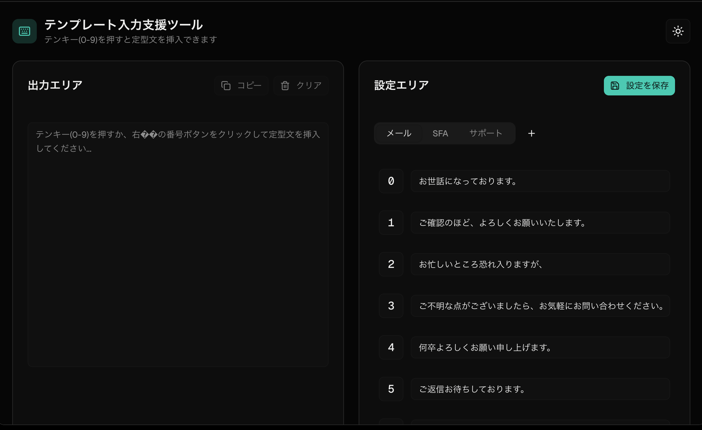

# Project A: モックアップ（Numpad Typer）

「テンプレート入力支援ツール」の画面イメージです。詳細な要件は [project-a-requirements.md](./project-a-requirements.md) を参照してください。

## 画面キャプチャ

## 構成の要点

- **ヘッダー** … ツール名・説明文、テーマ切り替え（ライト／ダーク）。
- **左：出力エリア** … テンキー（0〜9）または右側の番号操作で挿入した定型文を編集。「コピー」「クリア」でクリップボード利用とリセット。
- **右：設定エリア** … タブ（メール／SFA／サポートなど）でシーンを切り替え、各番号に割り当てた定型文を編集。「設定を保存」でローカルに保持する想定。
